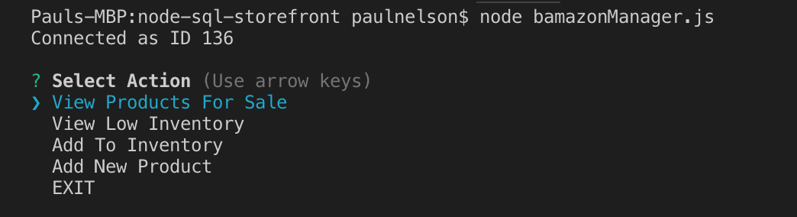
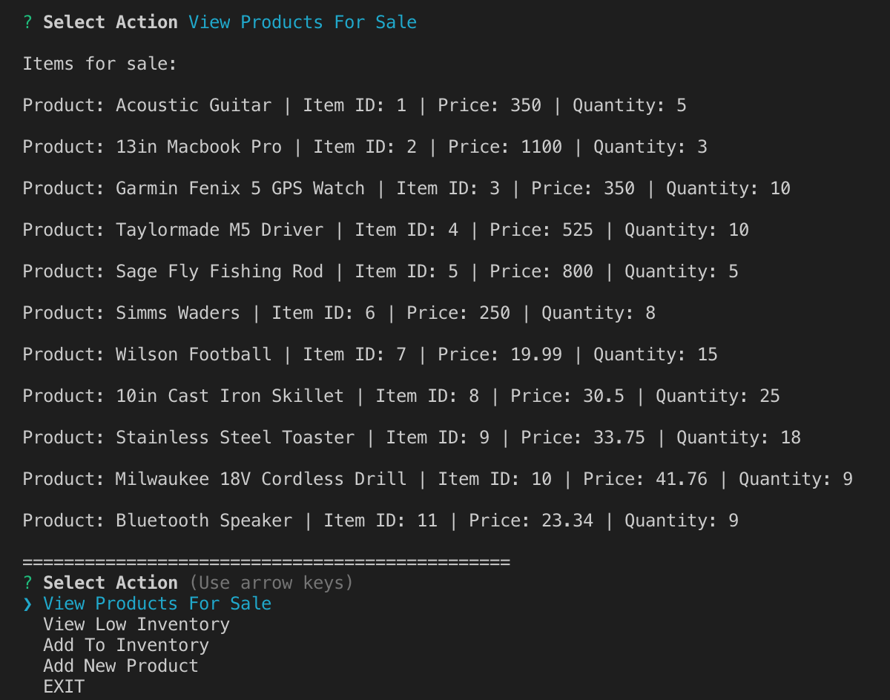
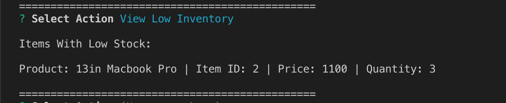
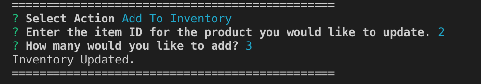
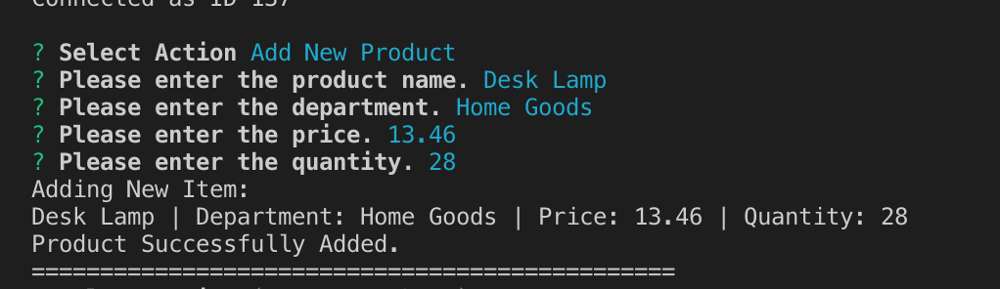

# node-sql-storefront

This application uses node.js and inquirer to perform storefront operations on the command line that connects with data stored in a mySQL database. 

## Requirements
In order to use this use schema.sql to create the bamazon database and products table in MySQL.  
In your command line, make sure you have the proper node modules by entering the following:
'npm install mysql'
'npm install inquirer'

### Customer View

In the command line, enter "node bamazonCustomer.js" to run the customer view functionality.

The application will display the items for sale, followed by instructions to purchase.

When prompted, select the item you would like to purchase by entering the item ID.  
After you have selected an item, you will be prompted to enter a quantity to purchase.
The app will then calculate your total, and update the inventory of the item.

### Manager View

In the command line, enter "node bamazonManager.js" to run the manager view functionality.

The application will display a menu list of items to chose from.

* __View Products For Sale:__  lists every available item with name, item ID, price, and quantity.

* __View Low Inventory:__  lists all items with an inventory count lower than five.

* __Add to Inventory:__  prompts the manager to increase the inventory of an item.

* __Add New Product:__  allows manager to add a completely new product to the store.

